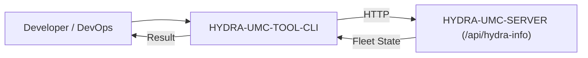

<p align="center">
  
</p>

# 💻 HYDRA-UMC-TOOL-CLI

<p align="center">🇺🇸 <b>English</b> | <a href="README_spa.md">🇪🇸 Español</a> | <a href="README_fra.md">🇫🇷 Français</a> | <a href="README_ita.md">🇮🇹 Italiano</a> | <a href="README_deu.md">🇩🇪 Deutsch</a> | <a href="README_zho.md">🇨🇳 简体中文</a> | <a href="README_jpn.md">🇯🇵 日本語</a></p>

### 🛠️ Command-Line Interface for Fleet DevOps & Automation

<p align="left">
  
  
  
</p>

---

## 1. 🛠️ TECHNICAL OVERVIEW

**HYDRA-UMC-TOOL-CLI** is the Swiss Army knife for developers and system administrators of the HYDRA-UMC ecosystem. It is a single static Go binary providing command-line tools to query, update, and audit HYDRA-UMC deployments.

The long-term goal is massive deployments of missions, parallel firmware updates (CAN-OTA), and deep system diagnostics directly from a terminal or CI/CD pipeline. Today it ships the real, working foundation that everything else builds on: version reporting and a live HTTP client against HYDRA-UMC-SERVER.

### Key Features:
* ✅ **`hydra-cli version`** — prints the CLI's own name and version. *(implemented)*
* ✅ **`hydra-cli status [--server URL]`** — queries a live HYDRA-UMC-SERVER's `GET /api/hydra-info` and prints its reported identity. *(implemented)*
* ✅ **`hydra-cli robots [--server URL]`** — queries a live HYDRA-UMC-SERVER's `GET /api/settings` and prints its real controller/robot roster (name, online status, model, role). *(implemented)*
* ✅ **`hydra-cli doctor [--server URL]`** — read-only Server contract diagnosis: validates `/api/hydra-info` and `/api/settings`, then verifies published controller/robot totals against the settings roster. It never sends commands or probes hardware. *(implemented)*
* ✅ **A real, stable exit-code contract** — `0` ok, `1` general error, `2` usage error, `3` config error, `4` network error, `5` server error, `6` not implemented. Every command classifies its own failures through this contract instead of a bare `exit 1`, so scripts wrapping this CLI can branch on *why* it failed. *(implemented)*
* ✅ **`hydra-cli config validate --config PATH`** — loads and schema-validates a local config file (server URL, request timeout). *(implemented)*
* ✅ **`hydra-cli config apply --config PATH [--dry-run]`** — `--dry-run` proves the real validation path end to end and prints exactly what it would send; without it, honestly returns "not implemented" since no live fleet-write endpoint exists yet. *(implemented, dry-run only)*
* ✅ **`hydra-cli shell [--server URL]`** — an interactive REPL: run any command above repeatedly against the same server without restarting the process. Dispatches through the exact same command table one-shot invocations use, so shell and one-shot behavior never drift apart. `exit`/`quit`/Ctrl-D to leave. *(implemented)*
* ✅ **`hydra-cli help` / `--help`** — full command usage. *(implemented)*
* 🚧 **`hydra-cli deploy`** — upload missions and configurations to a fleet of robots simultaneously. *(planned)*
* 🚧 **`hydra-cli flash-all`** — parallel firmware updates for controllers and URTC heads. *(planned)*
* 🚧 **`hydra-cli audit`** — automated diagnostic suite for CAN bus health and sensor validation. *(planned)*

---

## 2. 🔄 CLI WORKFLOW



---

## 3. 🧱 ARCHITECTURE & DESIGN DECISIONS

* **Why `src/` holds a `cmd/hydra-cli/` subpath, not a flat layout.** Matches the standard Go CLI convention (a `cmd/<binary-name>/` entry point, with room for future `internal/`/`pkg/` packages as the CLI grows past a single command) - not this ecosystem's own invention, the wider Go community's own convention for multi-command CLIs.
* **Why a CLI, not just scripting HYDRA-UMC-SERVER's own REST API directly.** Fleet-scale operations (install/update across many CM5s, not just one) need real orchestration - retries, parallelism, a consistent UX - that a one-off curl script doesn't provide, the same reasoning HYDRA-UMC-UPDATER later applies at the ecosystem-checkout level.
* **Why `robots` reads `GET /api/settings`, not a new endpoint.** That endpoint already carries the full controller/robot roster and is already a real, unauthenticated read (see HYDRA-UMC-SERVER's own `src/server.ts`) - `robots` is a real client of an already-shipping contract, not new server-side work. `doctor` uses that same read together with `/api/hydra-info` to catch incompatible public fleet totals without adding a new endpoint. The bigger, still-planned commands (`deploy`/`flash-all`/hardware-facing `audit`) genuinely do need new write endpoints that don't exist yet.
* **Why `doctor` is explicitly read-only.** An endpoint-contract check is useful before hardware exists and safe in CI. It reports only HTTP/JSON/count consistency; it neither commands equipment nor claims CAN, actuator, sensor, camera, Hailo, CM5, or safety health.
* **How this fits the rest of the ecosystem.** Does at fleet scale what URTC-FLASHER and URTC-TESTER each do for one board - manages HYDRA-UMC-SERVER instances across a fleet rather than a single board's own firmware.
* **Why `config apply` without `--dry-run` returns "not implemented" instead of silently doing nothing.** The live write endpoint on HYDRA-UMC-SERVER this would call genuinely does not exist yet (same gap `deploy`/`flash-all` are blocked on) - a distinct `ExitNotImplemented` exit code tells a caller "this is a real gap, not a bug" instead of a misleadingly successful no-op.
* **Why every command's errors now flow through one `CliError`/`ExitCode` type instead of ad-hoc `os.Exit` calls.** A stable, documented exit-code contract only stays stable if there is one place that assigns codes - `exitCodeFor()` (`exitcode.go`) is that place, and command functions keep returning idiomatic, wrappable `error` values rather than calling `os.Exit` themselves.

---

## 📂 DIRECTORY STRUCTURE

Pure-software CLI — no hardware, firmware or OS of its own; those folders are omitted by repository structure policy.

```text
HYDRA-UMC-TOOL-CLI/
├── src/                       # Go module
│   ├── go.mod                 # Module definition (github.com/JuanenRac/HYDRA-UMC-TOOL-CLI)
│   └── cmd/hydra-cli/         # Binary entry point
│       ├── main.go            # Command dispatch (version/help/status/robots/doctor/config)
│       ├── server.go          # Shared --server/HYDRA_CLI_SERVER resolution
│       ├── robots.go          # Real GET /api/settings client + roster printer
│       ├── doctor.go          # Read-only two-endpoint contract diagnostic
│       ├── config.go          # Real config file loading, validation, apply --dry-run
│       ├── exitcode.go        # Real, stable ExitCode/CliError contract
│       ├── *_test.go          # Real tests (net/http/httptest round-trips, temp-file fixtures)
│       └── version.go         # const Version - odometer-bumped, kept in sync with the manifest
├── docs/                      # Documentation: CLI_REFERENCE.md and DOCTOR.md
├── build/                     # Compiled binaries (gitignored)
├── images/                    # Media and diagrams
├── bump_version.py            # Odometer-style native version bump (run by build)
├── bump_manifest_version.py   # Syncs hydra-umc.project.json's version to the native one (--sync)
├── build.sh / build.bat       # Real build: bump + real test suite + go build + smoke test
├── run.sh / run.bat           # Real run: executes the compiled binary
└── README.md
```

---

## 4. ⚙️ BUILD & RUN GUIDE

Requires Go >= 1.21.

```bash
# Linux/macOS
./build.sh
./run.sh version
./run.sh status --server http://localhost:3000
./run.sh robots --server http://localhost:3000
./run.sh doctor --server http://localhost:3000
./run.sh config validate --config ./hydra-cli.json
./run.sh config apply --config ./hydra-cli.json --dry-run
echo $?   # 0=ok 2=usage 3=config 4=network 5=server 6=not-implemented

# Windows
build.bat
run.bat version
run.bat status --server http://localhost:3000
run.bat robots --server http://localhost:3000
run.bat doctor --server http://localhost:3000
run.bat config validate --config .\hydra-cli.json
run.bat config apply --config .\hydra-cli.json --dry-run
```

`build` bumps the version (`src/cmd/hydra-cli/version.go`), runs the real test suite (`go vet` + `go test`), compiles the Go module in `src/` into `build/hydra-cli(.exe)`, and runs `version` once to verify. `run` executes the compiled binary again, forwarding all arguments — try `run doctor` against a running `HYDRA-UMC-SERVER` instance. Doctor is a safe read-only endpoint-contract check; see [docs/DOCTOR.md](docs/DOCTOR.md).

---

## 🔗 Related Projects

This project is part of the HYDRA-UMC robotics ecosystem by the same author (JuanenRac / Electro Hobby 3D). Worth knowing about, since a request might actually be about one of these rather than this repository.

**Directly Related**
- **[HYDRA-UMC-SERVER](https://github.com/JuanenRac/HYDRA-UMC-SERVER)** — the real headless backend (REST/WebSocket) every control client actually talks to — the backend this CLI manages at fleet scale.
- **[URTC-FLASHER](https://github.com/JuanenRac/URTC-FLASHER)** — desktop GUI flashing tool for URTC boards, CAN-OTA plus full-chip SWD/JTAG — this tool's planned fleet-scale CAN-OTA deploy does for many boards what URTC-FLASHER does for one.
- **[URTC-TESTER](https://github.com/JuanenRac/URTC-TESTER)** — desktop live CAN-bus diagnostic tool for URTC boards, one panel per tool profile — this tool's planned fleet-scale diagnostics do for many boards what URTC-TESTER does for one.

**Also Part of the Ecosystem**

*Core Hardware & Platform*
- **[HYDRA-UMC](https://github.com/JuanenRac/HYDRA-UMC)** — the physical robot-arm motherboard: CM5 host + dual-core STM32H745, orchestrating up to 8 tool arms over CAN-OTA/SPI-OTA.
- **[HYDRA-UMC-OS](https://github.com/JuanenRac/HYDRA-UMC-OS)** — reproducible Raspberry Pi OS product layer for the CM5: read-only agent, validated config/profiles, WiFi first-contact provisioning.
- **[HYDRA-UMC-SDK](https://github.com/JuanenRac/HYDRA-UMC-SDK)** — the shared JSON-Schema contract and safety-gate boundary every bridge validates its commands against.

*Core Backend & Clients*
- **[HYDRA-UMC-STUDIO](https://github.com/JuanenRac/HYDRA-UMC-STUDIO)** — web control dashboard with real-time multi-robot 3D visualization.
- **[HYDRA-UMC-SUITE](https://github.com/JuanenRac/HYDRA-UMC-SUITE)** — desktop (PySide6) swarm command center for multiple servers at once, packaged as a standalone executable.
- **[HYDRA-UMC-ANDROID-CONTROL](https://github.com/JuanenRac/HYDRA-UMC-ANDROID-CONTROL)** — native Android control app with biometric login and a paired Wear OS companion.
- **[HYDRA-UMC-IOS-CONTROL](https://github.com/JuanenRac/HYDRA-UMC-IOS-CONTROL)** — iOS/iPadOS control app (Flutter) with real-time WebSocket sync.
- **[HYDRA-UMC-DSI](https://github.com/JuanenRac/HYDRA-UMC-DSI)** — native touch UI for the onboard 7" DSI touchscreen, embedded on the CM5 itself.
- **[HYDRA-UMC-EDITOR-URDF](https://github.com/JuanenRac/HYDRA-UMC-EDITOR-URDF)** — desktop graphical URDF creator/editor that pushes finished models into STUDIO's own catalog.
- **[HYDRA-UMC-BRIDGE-AMR](https://github.com/JuanenRac/HYDRA-UMC-BRIDGE-AMR)** — coordination boundary for AGV/AMR fleets via a real VDA 5050 MQTT publisher.
- **[HYDRA-UMC-BRIDGE-CNC](https://github.com/JuanenRac/HYDRA-UMC-BRIDGE-CNC)** — high-level CNC-cell coordinator with real GRBL status/control-byte access.
- **[HYDRA-UMC-BRIDGE-DROIDS](https://github.com/JuanenRac/HYDRA-UMC-BRIDGE-DROIDS)** — coordination boundary for legged/humanoid droids, with a real Boston Dynamics Spot command sender.
- **[HYDRA-UMC-BRIDGE-LASER](https://github.com/JuanenRac/HYDRA-UMC-BRIDGE-LASER)** — laser-cell safety coordinator reading 3 real key/enclosure/interlock GPIO safeguards.
- **[HYDRA-UMC-BRIDGE-OPENPNP](https://github.com/JuanenRac/HYDRA-UMC-BRIDGE-OPENPNP)** — safe high-level board-flow coordinator for OpenPnP pick-and-place.
- **[HYDRA-UMC-BRIDGE-PRINTER3D](https://github.com/JuanenRac/HYDRA-UMC-BRIDGE-PRINTER3D)** — safe coordination boundary for Moonraker/Klipper 3D printers, with real gated job commands.
- **[HYDRA-UMC-BRIDGE-ROS2](https://github.com/JuanenRac/HYDRA-UMC-BRIDGE-ROS2)** — safety coordinator with a real, lazily-imported rclpy ROS 2 transport.
- **[HYDRA-UMC-BRIDGE-UAV](https://github.com/JuanenRac/HYDRA-UMC-BRIDGE-UAV)** — coordination boundary for camera-equipped UAVs, with a real MAVLink command sender.

*URTC Tool Platform*
- **[URTC](https://github.com/JuanenRac/URTC)** — firmware for the physical Universal Robot Tool Controller PCB, 25+ tool profiles over CAN bus.
- **[URTC-WEB-STUDIO](https://github.com/JuanenRac/URTC-WEB-STUDIO)** — browser-based alternative to URTC-TESTER via the Web Serial API, no local install needed.

*Vision AI Node (Hailo-8)*
- **[HYDRA-UMC-VISION-NODE](https://github.com/JuanenRac/HYDRA-UMC-VISION-NODE)** — integration hub for the Hailo-8 vision pipeline, with a real per-stage hardware-readiness check.
- **[HYDRA-UMC-DETECTION-HEF](https://github.com/JuanenRac/HYDRA-UMC-DETECTION-HEF)** — real compiled-model registry with Hailo-architecture/checksum safe-load verification.
- **[HYDRA-UMC-VISION-STREAMER](https://github.com/JuanenRac/HYDRA-UMC-VISION-STREAMER)** — real GStreamer pipeline + MediaMTX config generator with a real HailoRT integration boundary.
- **[HYDRA-UMC-VISUAL-SERVOING-API](https://github.com/JuanenRac/HYDRA-UMC-VISUAL-SERVOING-API)** — real Position-Based Visual Servoing correction law, safety-gated on upstream zone state.
- **[HYDRA-UMC-SAFETY-ZONES](https://github.com/JuanenRac/HYDRA-UMC-SAFETY-ZONES)** — real zone-breach checking and E-STOP requesting, with calibration-freshness enforcement.

*Cognitive AI Node (Hailo-10)*
- **[HYDRA-UMC-COGNITIVE-NODE](https://github.com/JuanenRac/HYDRA-UMC-COGNITIVE-NODE)** — integration hub for the Hailo-10 cognitive pipeline (LLM/VLA/voice orchestration).
- **[HYDRA-UMC-VLA-ENGINE](https://github.com/JuanenRac/HYDRA-UMC-VLA-ENGINE)** — real action-token encoding/decoding and trajectory generation for a Vision-Language-Action model.
- **[HYDRA-UMC-VOICE-UI](https://github.com/JuanenRac/HYDRA-UMC-VOICE-UI)** — real voice front-end (VAD + intent parser) with a bounded, confirmation-gated Watch relay.
- **[HYDRA-UMC-SEMANTIC-PLANNER](https://github.com/JuanenRac/HYDRA-UMC-SEMANTIC-PLANNER)** — real rule-based task decomposition and semantic error recovery over MCU error codes.
- **[HYDRA-UMC-DOCS-QA](https://github.com/JuanenRac/HYDRA-UMC-DOCS-QA)** — real stdlib-only TF-IDF document search over this ecosystem's own Markdown docs.

*Orchestration & Swarm*
- **[HYDRA-UMC-ORCHESTRATOR](https://github.com/JuanenRac/HYDRA-UMC-ORCHESTRATOR)** — integration hub with a real gRPC/Protobuf health-report contract and mission state machine.
- **[HYDRA-UMC-JOB-DISPATCHER](https://github.com/JuanenRac/HYDRA-UMC-JOB-DISPATCHER)** — real priority-based job queue with deduplication, over a real HTTP API.
- **[HYDRA-UMC-NODE-HEALING](https://github.com/JuanenRac/HYDRA-UMC-NODE-HEALING)** — real gRPC-based fleet health watchdog with retry/backoff and identity-mismatch detection.
- **[HYDRA-UMC-PATH-PLANNER-3D](https://github.com/JuanenRac/HYDRA-UMC-PATH-PLANNER-3D)** — real RRT-based 3D path planner with real obstacle/workspace collision validation.
- **[HYDRA-UMC-SWARM-SYNC](https://github.com/JuanenRac/HYDRA-UMC-SWARM-SYNC)** — real CRDT LWW-Element-Map state sync, property-tested for multi-cell convergence.

*Digital Twin & Simulation*
- **[HYDRA-UMC-TWIN](https://github.com/JuanenRac/HYDRA-UMC-TWIN)** — integration hub for the digital-twin engine, with a real version-compatibility sync contract.
- **[HYDRA-UMC-HIL-BRIDGE](https://github.com/JuanenRac/HYDRA-UMC-HIL-BRIDGE)** — real hardware-in-the-loop safety interlock routing commands between simulation and real hardware.
- **[HYDRA-UMC-PHYSICS-REPLICA](https://github.com/JuanenRac/HYDRA-UMC-PHYSICS-REPLICA)** — real forward kinematics and joint-limit validation over a real URDF subset.
- **[HYDRA-UMC-SYNTHETIC-DATA-GEN](https://github.com/JuanenRac/HYDRA-UMC-SYNTHETIC-DATA-GEN)** — real procedural 2D scene generator with YOLO/COCO annotation export.

*Data & Analytics*
- **[HYDRA-UMC-DATALAKE](https://github.com/JuanenRac/HYDRA-UMC-DATALAKE)** — real sqlite3-backed time-series store with a real ingest/query HTTP API.
- **[HYDRA-UMC-ANOMALY-DETECTOR](https://github.com/JuanenRac/HYDRA-UMC-ANOMALY-DETECTOR)** — real FFT + statistical baseline anomaly detector with drift monitoring.
- **[HYDRA-UMC-PRODUCTION-REPORTS](https://github.com/JuanenRac/HYDRA-UMC-PRODUCTION-REPORTS)** — real OEE/availability calculation over DATALAKE history, with reproducible CSV export.
- **[HYDRA-UMC-TELEMETRY-COLLECTOR](https://github.com/JuanenRac/HYDRA-UMC-TELEMETRY-COLLECTOR)** — real CAN/WebSocket ingestion pipeline into DATALAKE, with sequence deduplication.

*Industrial Gateway*
- **[HYDRA-UMC-GATEWAY-INDUSTRIAL](https://github.com/JuanenRac/HYDRA-UMC-GATEWAY-INDUSTRIAL)** — integration hub relaying to industrial protocols, with a real command allowlist/backpressure layer.
- **[HYDRA-UMC-OPCUA-SERVER](https://github.com/JuanenRac/HYDRA-UMC-OPCUA-SERVER)** — real OPC-UA address space, verified with a real binary-protocol client session.
- **[HYDRA-UMC-MQTT-BROKER](https://github.com/JuanenRac/HYDRA-UMC-MQTT-BROKER)** — real MQTT broker with optional per-client authentication and topic ACLs.
- **[HYDRA-UMC-MTCONNECT-ADAPTER](https://github.com/JuanenRac/HYDRA-UMC-MTCONNECT-ADAPTER)** — real MTConnect `/probe` and `/current` XML endpoints with degraded-mode output.

*Complementary Tools & Ecosystem Operations*
- **[HYDRA-UMC-DASHBOARD-AI](https://github.com/JuanenRac/HYDRA-UMC-DASHBOARD-AI)** — Smart Summaries and Anomaly Highlighting panels over DATALAKE/ANOMALY-DETECTOR, with an honest statistical fallback.
- **[HYDRA-UMC-WATCH](https://github.com/JuanenRac/HYDRA-UMC-WATCH)** — WearOS companion app with real haptic alerts and a paired-phone voice relay.
- **[URTC-SMART-RACK](https://github.com/JuanenRac/URTC-SMART-RACK)** — firmware for a board-mounting rack with real tool-ID decoding and Smart Idle pre-heating logic.
- **[URTC-VISION-TOOL](https://github.com/JuanenRac/URTC-VISION-TOOL)** — firmware plus a real Python vision companion for a thermal/RGB inspection tool head.
- **[HYDRA-UMC-UPDATER](https://github.com/JuanenRac/HYDRA-UMC-UPDATER)** — administrative desktop tool that discovers, clones and updates every repo in this ecosystem.


## 👤 AUTHOR
**JuanenRac** (Electro Hobby 3D)
📧 electrohobby3d@gmail.com
📺 [youtube.com/@electrohobby3d](https://youtube.com/@electrohobby3d)

## 📜 LICENSE
GPL-3.0 - See LICENSE for details.
