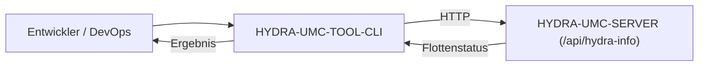

<p align="center">
  
</p>

# 💻 HYDRA-UMC-TOOL-CLI

<p align="center"><a href="README.md">🇺🇸 English</a> | <a href="README_spa.md">🇪🇸 Español</a> | <a href="README_fra.md">🇫🇷 Français</a> | <a href="README_ita.md">🇮🇹 Italiano</a> | 🇩🇪 <b>Deutsch</b> | <a href="README_zho.md">🇨🇳 简体中文</a> | <a href="README_jpn.md">🇯🇵 日本語</a></p>

### 🛠️ Kommandozeilen-Schnittstelle für Flotten-DevOps & Automatisierung

<p align="left">
  
  
  
</p>

---

## 1. 🛠️ TECHNISCHER ÜBERBLICK

**HYDRA-UMC-TOOL-CLI** ist das Schweizer Taschenmesser für Entwickler und Systemadministratoren des HYDRA-UMC-Ökosystems. Es ist eine einzelne statische Go-Binärdatei, die Kommandozeilenwerkzeuge zum Abfragen, Aktualisieren und Prüfen von HYDRA-UMC-Deployments bereitstellt.

Das langfristige Ziel sind massive Missionsausrollungen, parallele Firmware-Updates (CAN-OTA) und tiefgehende Systemdiagnosen direkt aus einem Terminal oder einer CI/CD-Pipeline. Heute enthält es das reale, funktionierende Fundament, auf dem alles Weitere aufbaut: Versionsauskunft und einen echten HTTP-Client gegen HYDRA-UMC-SERVER.

### Hauptmerkmale:
* ✅ **`hydra-cli version`** — gibt Name und Version des CLI selbst aus. *(implementiert)*
* ✅ **`hydra-cli status [--server URL]`** — fragt `GET /api/hydra-info` einer laufenden HYDRA-UMC-SERVER-Instanz ab und gibt deren gemeldete Identität aus. *(implementiert)*
* ✅ **`hydra-cli robots [--server URL]`** — fragt `GET /api/settings` einer laufenden HYDRA-UMC-SERVER-Instanz ab und gibt deren echte Controller-/Roboterliste aus (Name, Online-Status, Modell, Rolle). *(implementiert)*
* ✅ **`hydra-cli doctor [--server URL]`** — schreibgeschützte Server-Vertragsdiagnose: prüft `/api/hydra-info` und `/api/settings` und vergleicht veröffentlichte Controller-/Roboterzahlen mit der Liste. Sendet keine Befehle und prüft keine Hardware. *(implementiert)*
* ✅ **Ein echter, stabiler Exit-Code-Vertrag** — `0` ok, `1` allgemeiner Fehler, `2` Nutzungsfehler, `3` Konfigurationsfehler, `4` Netzwerkfehler, `5` Serverfehler, `6` nicht implementiert. Jeder Befehl klassifiziert seine eigenen Fehlschläge über diesen Vertrag statt über ein bloßes `exit 1`, sodass Skripte, die dieses CLI umschließen, anhand des *Warum* eines Fehlschlags verzweigen können. *(implementiert)*
* ✅ **`hydra-cli config validate --config PATH`** — lädt und validiert eine lokale Konfigurationsdatei anhand eines Schemas (Server-URL, Anfrage-Timeout). *(implementiert)*
* ✅ **`hydra-cli config apply --config PATH [--dry-run]`** — `--dry-run` beweist den echten Validierungspfad end-to-end und gibt genau aus, was gesendet würde; ohne diese Option liefert der Befehl ehrlich "nicht implementiert" zurück, da es noch keinen Live-Schreib-Endpunkt für die Flotte gibt. *(implementiert, nur dry-run)*
* ✅ **`hydra-cli shell [--server URL]`** — eine interaktive REPL: führt jeden der obigen Befehle wiederholt gegen denselben Server aus, ohne den Prozess neu zu starten. Leitet über dieselbe Befehlstabelle weiter, die auch Einzelaufrufe nutzen, sodass Shell- und Einzelaufruf-Verhalten niemals auseinanderdriften können. `exit`/`quit`/Strg+D zum Verlassen. *(implementiert)*
* ✅ **`hydra-cli help` / `--help`** — vollständige Befehlsübersicht. *(implementiert)*
* 🚧 **`hydra-cli deploy`** — lädt Missionen und Konfigurationen gleichzeitig auf eine Roboterflotte hoch. *(geplant)*
* 🚧 **`hydra-cli flash-all`** — parallele Firmware-Updates für Controller und URTC-Köpfe. *(geplant)*
* 🚧 **`hydra-cli audit`** — automatisierte Diagnosesuite für CAN-Bus-Gesundheit und Sensorvalidierung. *(geplant)*

---

## 2. 🔄 CLI-WORKFLOW



---

## 3. 🧱 ARCHITEKTUR & DESIGNENTSCHEIDUNGEN

* **Warum `src/` einen Unterpfad `cmd/hydra-cli/` enthält, kein flaches Layout.** Folgt der Standard-Go-Konvention für CLIs (ein Einstiegspunkt `cmd/<Binärname>/`, mit Platz für künftige `internal/`/`pkg/`-Pakete, sobald die CLI über einen einzelnen Befehl hinauswächst) - keine Erfindung dieses Ökosystems, sondern die eigene Konvention der breiteren Go-Community für Multi-Befehl-CLIs.
* **Warum eine CLI und nicht einfach direktes Scripting gegen die eigene REST-API von HYDRA-UMC-SERVER.** Operationen im Flottenmaßstab (Installieren/Aktualisieren über viele CM5, nicht nur eines) brauchen echte Orchestrierung - Wiederholungen, Parallelität, eine konsistente UX -, die ein einmaliges curl-Skript nicht bietet, derselbe Grund, den HYDRA-UMC-UPDATER später auf Ebene des gesamten Ökosystem-Checkouts anwendet.
* **Wie sich das ins restliche Ökosystem einfügt.** Macht im Flottenmaßstab, was URTC-FLASHER und URTC-TESTER jeweils für eine einzelne Platine machen - verwaltet HYDRA-UMC-SERVER-Instanzen über eine Flotte hinweg statt der eigenen Firmware einer einzelnen Platine.
* **Warum `robots` `GET /api/settings` liest statt eines neuen Endpunkts.** Dieser Endpunkt liefert bereits die vollständige Controller-/Roboterliste und ist bereits eine echte, unauthentifizierte Lese-Operation (siehe das eigene `src/server.ts` von HYDRA-UMC-SERVER) - `robots` ist ein echter Client eines bereits ausgelieferten Vertrags, keine neue serverseitige Arbeit. `doctor` nutzt dieselbe Lese-Operation zusammen mit `/api/hydra-info`, um inkompatible öffentliche Flottenzahlen ohne neuen Endpunkt zu erkennen. Die größeren, noch geplanten Befehle (`deploy`/`flash-all`/hardwarebezogenes `audit`) benötigen wirklich neue Schreib-Endpunkte, die noch nicht existieren.
* **Warum `doctor` ausdrücklich schreibgeschützt ist.** Eine Vertragsprüfung ist vor vorhandener Hardware nützlich und in CI sicher. Sie meldet nur HTTP-/JSON-/Zählerkonsistenz; sie steuert keine Geräte und behauptet keine CAN-, Aktor-, Sensor-, Kamera-, Hailo-, CM5- oder Sicherheitsgesundheit.
* **Warum `config apply` ohne `--dry-run` "nicht implementiert" zurückgibt, statt still nichts zu tun.** Der Live-Schreib-Endpunkt auf HYDRA-UMC-SERVER, den dies aufrufen würde, existiert tatsächlich noch nicht (dieselbe Lücke, an der auch `deploy`/`flash-all` hängen) - ein eigener `ExitNotImplemented`-Exit-Code sagt dem Aufrufer "das ist eine echte Lücke, kein Bug", statt eines irreführend erfolgreichen No-ops.
* **Warum die Fehler jedes Befehls jetzt über einen einzigen `CliError`/`ExitCode`-Typ laufen statt über Ad-hoc-Aufrufe von `os.Exit`.** Ein stabiler, dokumentierter Exit-Code-Vertrag bleibt nur stabil, wenn es eine einzige Stelle gibt, die Codes vergibt - `exitCodeFor()` (`exitcode.go`) ist diese Stelle, und die Befehlsfunktionen geben weiterhin idiomatische, verkettbare `error`-Werte zurück, statt selbst `os.Exit` aufzurufen.

---

## 📂 VERZEICHNISSTRUKTUR

Reiner Software-Dienst (CLI) — ohne eigene Hardware, Firmware oder Betriebssystem; diese Ordner werden gemäß der Repository-Strukturpolitik ausgelassen.

```text
HYDRA-UMC-TOOL-CLI/
├── src/                       # Go-Modul
│   ├── go.mod                 # Modul-Definition (github.com/JuanenRac/HYDRA-UMC-TOOL-CLI)
│   └── cmd/hydra-cli/         # Binary-Einstiegspunkt
│       ├── main.go            # Befehls-Dispatch (version/help/status/robots/doctor/config)
│       ├── server.go          # Gemeinsame Auflösung von --server/HYDRA_CLI_SERVER
│       ├── robots.go          # Echter GET /api/settings-Client + Listenausgabe
│       ├── doctor.go          # Schreibgeschützte Zwei-Endpunkt-Vertragsdiagnose
│       ├── config.go          # Echtes Laden, Validieren und apply --dry-run der Konfigurationsdatei
│       ├── exitcode.go        # Echter, stabiler ExitCode/CliError-Vertrag
│       ├── *_test.go          # Echte Tests (net/http/httptest-Roundtrips, Fixtures mit temporären Dateien)
│       └── version.go         # const Version - Kilometerzähler-Inkrement, synchron mit dem Manifest gehalten
├── docs/                      # Dokumentation: CLI_REFERENCE.md und DOCTOR.md
├── build/                     # Kompilierte Binärdateien (von git ignoriert)
├── images/                    # Medien und Diagramme
├── bump_version.py            # Native Versionserhöhung nach Kilometerzähler-Prinzip (vom Build ausgeführt)
├── bump_manifest_version.py   # Synchronisiert die Version von hydra-umc.project.json mit der nativen (--sync)
├── build.sh / build.bat       # Echter Build: Erhöhung + echte Testsuite + go build + Rauchtest
├── run.sh / run.bat           # Echte Ausführung: startet die kompilierte Binärdatei
└── README.md
```

---

## 4. ⚙️ BUILD & AUSFÜHRUNG

Erfordert Go >= 1.21.

```bash
# Linux/macOS
./build.sh
./run.sh version
./run.sh status --server http://localhost:3000
./run.sh robots --server http://localhost:3000
./run.sh doctor --server http://localhost:3000
./run.sh config validate --config ./hydra-cli.json
./run.sh config apply --config ./hydra-cli.json --dry-run
echo $?   # 0=ok 2=Nutzung 3=Konfiguration 4=Netzwerk 5=Server 6=nicht-implementiert

# Windows
build.bat
run.bat version
run.bat status --server http://localhost:3000
run.bat robots --server http://localhost:3000
run.bat doctor --server http://localhost:3000
run.bat config validate --config .\hydra-cli.json
run.bat config apply --config .\hydra-cli.json --dry-run
```

`build` erhöht die Version (`src/cmd/hydra-cli/version.go`), führt die echte Testsuite aus (`go vet` + `go test`), kompiliert das Go-Modul in `src/` nach `build/hydra-cli(.exe)` und führt einmalig `version` zur Verifikation aus. `run` führt die kompilierte Binärdatei erneut aus und leitet alle Argumente weiter — probiere `run doctor` gegen eine laufende `HYDRA-UMC-SERVER`-Instanz. Doctor ist eine sichere, schreibgeschützte Endpunkt-Vertragsprüfung; siehe [docs/DOCTOR.md](docs/DOCTOR.md).

---

## 🔗 Verwandte Projekte

Dieses Projekt ist Teil des HYDRA-UMC-Robotik-Ökosystems desselben Autors (JuanenRac / Electro Hobby 3D). Gut zu wissen, da eine Anfrage eigentlich eines dieser Projekte betreffen könnte statt dieses Repositorys.

**Direkt verwandt**
- **[HYDRA-UMC-SERVER](https://github.com/JuanenRac/HYDRA-UMC-SERVER)** — das reale Headless-Backend (REST/WebSocket), mit dem jeder Steuerungsclient tatsächlich spricht — das Backend, das diese CLI im Flottenmaßstab verwaltet.
- **[URTC-FLASHER](https://github.com/JuanenRac/URTC-FLASHER)** — Desktop-GUI-Flash-Tool für URTC-Platinen, CAN-OTA plus Full-Chip-SWD/JTAG — der geplante flottenweite CAN-OTA-Deploy dieses Tools tut für viele Platinen, was URTC-FLASHER für eine tut.
- **[URTC-TESTER](https://github.com/JuanenRac/URTC-TESTER)** — Desktop-Live-CAN-Bus-Diagnosetool für URTC-Platinen, ein Panel pro Werkzeugprofil — die geplante flottenweite Diagnose dieses Tools tut für viele Platinen, was URTC-TESTER für eine tut.

**Ebenfalls Teil des Ökosystems**

*Kern-Hardware & Plattform*
- **[HYDRA-UMC](https://github.com/JuanenRac/HYDRA-UMC)** — das physische Motherboard des Roboterarms: CM5-Host + Dual-Core-STM32H745, koordiniert bis zu 8 Werkzeugarme über CAN-OTA/SPI-OTA.
- **[HYDRA-UMC-OS](https://github.com/JuanenRac/HYDRA-UMC-OS)** — reproduzierbare Raspberry-Pi-OS-Produktschicht für den CM5: schreibgeschützter Agent, validierte Konfiguration/Profile, WiFi-Ersteinrichtung.
- **[HYDRA-UMC-SDK](https://github.com/JuanenRac/HYDRA-UMC-SDK)** — der gemeinsame JSON-Schema-Vertrag und die Sicherheitsschranke, gegen die jede Bridge ihre Befehle validiert.

*Kern-Backend & Clients*
- **[HYDRA-UMC-STUDIO](https://github.com/JuanenRac/HYDRA-UMC-STUDIO)** — Web-Steuerungs-Dashboard mit Echtzeit-3D-Visualisierung mehrerer Roboter.
- **[HYDRA-UMC-SUITE](https://github.com/JuanenRac/HYDRA-UMC-SUITE)** — Desktop-Schwarmleitstand (PySide6) für mehrere Server gleichzeitig, verpackt als eigenständige ausführbare Datei.
- **[HYDRA-UMC-ANDROID-CONTROL](https://github.com/JuanenRac/HYDRA-UMC-ANDROID-CONTROL)** — native Android-Steuerungs-App mit biometrischem Login und einer gekoppelten Wear-OS-Begleit-App.
- **[HYDRA-UMC-IOS-CONTROL](https://github.com/JuanenRac/HYDRA-UMC-IOS-CONTROL)** — iOS/iPadOS-Steuerungs-App (Flutter) mit Echtzeit-WebSocket-Synchronisierung.
- **[HYDRA-UMC-DSI](https://github.com/JuanenRac/HYDRA-UMC-DSI)** — native Touch-UI für das eingebaute 7"-DSI-Touchscreen, direkt auf dem CM5 eingebettet.
- **[HYDRA-UMC-EDITOR-URDF](https://github.com/JuanenRac/HYDRA-UMC-EDITOR-URDF)** — grafischer Desktop-URDF-Ersteller/-Editor, der fertige Modelle in STUDIOs eigenen Katalog überträgt.
- **[HYDRA-UMC-BRIDGE-AMR](https://github.com/JuanenRac/HYDRA-UMC-BRIDGE-AMR)** — Koordinationsschranke für AGV-/AMR-Flotten über einen echten VDA-5050-MQTT-Publisher.
- **[HYDRA-UMC-BRIDGE-CNC](https://github.com/JuanenRac/HYDRA-UMC-BRIDGE-CNC)** — High-Level-Koordinator für CNC-Zellen mit echtem GRBL-Status-/Steuerbyte-Zugriff.
- **[HYDRA-UMC-BRIDGE-DROIDS](https://github.com/JuanenRac/HYDRA-UMC-BRIDGE-DROIDS)** — Koordinationsschranke für laufende/humanoide Droiden, mit einem echten Boston-Dynamics-Spot-Befehlssender.
- **[HYDRA-UMC-BRIDGE-LASER](https://github.com/JuanenRac/HYDRA-UMC-BRIDGE-LASER)** — Sicherheitskoordinator für Laserzellen, liest 3 echte Schlüssel-/Gehäuse-/Verriegelungs-GPIO-Sicherungen.
- **[HYDRA-UMC-BRIDGE-OPENPNP](https://github.com/JuanenRac/HYDRA-UMC-BRIDGE-OPENPNP)** — sicherer High-Level-Koordinator für den Leiterplattenfluss von OpenPnP Pick-and-Place.
- **[HYDRA-UMC-BRIDGE-PRINTER3D](https://github.com/JuanenRac/HYDRA-UMC-BRIDGE-PRINTER3D)** — sichere Koordinationsschranke für Moonraker/Klipper-3D-Drucker, mit echten gesicherten Job-Befehlen.
- **[HYDRA-UMC-BRIDGE-ROS2](https://github.com/JuanenRac/HYDRA-UMC-BRIDGE-ROS2)** — Sicherheitskoordinator mit einem echten, träge importierten rclpy-ROS-2-Transport.
- **[HYDRA-UMC-BRIDGE-UAV](https://github.com/JuanenRac/HYDRA-UMC-BRIDGE-UAV)** — Koordinationsschranke für kameraausgestattete UAVs, mit einem echten MAVLink-Befehlssender.

*URTC-Werkzeugplattform*
- **[URTC](https://github.com/JuanenRac/URTC)** — Firmware für die physische Universal-Robot-Tool-Controller-Platine, 25+ Werkzeugprofile über CAN-Bus.
- **[URTC-WEB-STUDIO](https://github.com/JuanenRac/URTC-WEB-STUDIO)** — browserbasierte Alternative zu URTC-TESTER über die Web-Serial-API, ohne lokale Installation.

*Vision-KI-Knoten (Hailo-8)*
- **[HYDRA-UMC-VISION-NODE](https://github.com/JuanenRac/HYDRA-UMC-VISION-NODE)** — Integrationsknoten für die Hailo-8-Vision-Pipeline, mit einer echten stufenweisen Hardware-Bereitschaftsprüfung.
- **[HYDRA-UMC-DETECTION-HEF](https://github.com/JuanenRac/HYDRA-UMC-DETECTION-HEF)** — echte Registry für kompilierte Modelle mit Hailo-Architektur-/Prüfsummen-Safe-Load-Verifizierung.
- **[HYDRA-UMC-VISION-STREAMER](https://github.com/JuanenRac/HYDRA-UMC-VISION-STREAMER)** — echter GStreamer-Pipeline- + MediaMTX-Konfigurationsgenerator mit einer echten HailoRT-Integrationsschranke.
- **[HYDRA-UMC-VISUAL-SERVOING-API](https://github.com/JuanenRac/HYDRA-UMC-VISUAL-SERVOING-API)** — echtes Position-Based-Visual-Servoing-Korrekturgesetz, sicherheitsgesteuert nach vorgelagertem Zonenstatus.
- **[HYDRA-UMC-SAFETY-ZONES](https://github.com/JuanenRac/HYDRA-UMC-SAFETY-ZONES)** — echte Zonenverletzungsprüfung und E-STOP-Anforderung, mit erzwungener Kalibrierungsaktualität.

*Kognitiver KI-Knoten (Hailo-10)*
- **[HYDRA-UMC-COGNITIVE-NODE](https://github.com/JuanenRac/HYDRA-UMC-COGNITIVE-NODE)** — Integrationsknoten für die Hailo-10-Cognitive-Pipeline (LLM-/VLA-/Sprach-Orchestrierung).
- **[HYDRA-UMC-VLA-ENGINE](https://github.com/JuanenRac/HYDRA-UMC-VLA-ENGINE)** — echte Aktions-Token-Kodierung/-Dekodierung und Trajektoriengenerierung für ein Vision-Language-Action-Modell.
- **[HYDRA-UMC-VOICE-UI](https://github.com/JuanenRac/HYDRA-UMC-VOICE-UI)** — echtes Sprach-Frontend (VAD + Intent-Parser) mit einem begrenzten, bestätigungsgesicherten Watch-Relay.
- **[HYDRA-UMC-SEMANTIC-PLANNER](https://github.com/JuanenRac/HYDRA-UMC-SEMANTIC-PLANNER)** — echte regelbasierte Aufgabenzerlegung und semantische Fehlerbehebung über MCU-Fehlercodes.
- **[HYDRA-UMC-DOCS-QA](https://github.com/JuanenRac/HYDRA-UMC-DOCS-QA)** — echte, nur auf der Standardbibliothek basierende TF-IDF-Dokumentensuche über die eigenen Markdown-Dokumente dieses Ökosystems.

*Orchestrierung & Schwarm*
- **[HYDRA-UMC-ORCHESTRATOR](https://github.com/JuanenRac/HYDRA-UMC-ORCHESTRATOR)** — Integrationsknoten mit einem echten gRPC/Protobuf-Health-Report-Vertrag und einer Missions-Zustandsmaschine.
- **[HYDRA-UMC-JOB-DISPATCHER](https://github.com/JuanenRac/HYDRA-UMC-JOB-DISPATCHER)** — echte prioritätsbasierte Job-Queue mit Deduplizierung, über eine echte HTTP-API.
- **[HYDRA-UMC-NODE-HEALING](https://github.com/JuanenRac/HYDRA-UMC-NODE-HEALING)** — echter gRPC-basierter Flotten-Health-Watchdog mit Retry/Backoff und Identitäts-Mismatch-Erkennung.
- **[HYDRA-UMC-PATH-PLANNER-3D](https://github.com/JuanenRac/HYDRA-UMC-PATH-PLANNER-3D)** — echter RRT-basierter 3D-Pfadplaner mit echter Hindernis-/Arbeitsraum-Kollisionsvalidierung.
- **[HYDRA-UMC-SWARM-SYNC](https://github.com/JuanenRac/HYDRA-UMC-SWARM-SYNC)** — echte CRDT-LWW-Element-Map-Zustandssynchronisation, eigenschaftsgetestet auf Multi-Zellen-Konvergenz.

*Digitaler Zwilling & Simulation*
- **[HYDRA-UMC-TWIN](https://github.com/JuanenRac/HYDRA-UMC-TWIN)** — Integrationsknoten für die Digital-Twin-Engine, mit einem echten Versionskompatibilitäts-Sync-Vertrag.
- **[HYDRA-UMC-HIL-BRIDGE](https://github.com/JuanenRac/HYDRA-UMC-HIL-BRIDGE)** — echte Hardware-in-the-Loop-Sicherheitsverriegelung, die Befehle zwischen Simulation und echter Hardware routet.
- **[HYDRA-UMC-PHYSICS-REPLICA](https://github.com/JuanenRac/HYDRA-UMC-PHYSICS-REPLICA)** — echte Vorwärtskinematik und Gelenkgrenzenvalidierung über eine echte URDF-Teilmenge.
- **[HYDRA-UMC-SYNTHETIC-DATA-GEN](https://github.com/JuanenRac/HYDRA-UMC-SYNTHETIC-DATA-GEN)** — echter prozeduraler 2D-Szenengenerator mit YOLO/COCO-Annotationsexport.

*Daten & Analytik*
- **[HYDRA-UMC-DATALAKE](https://github.com/JuanenRac/HYDRA-UMC-DATALAKE)** — echter sqlite3-gestützter Zeitreihenspeicher mit einer echten Ingest-/Abfrage-HTTP-API.
- **[HYDRA-UMC-ANOMALY-DETECTOR](https://github.com/JuanenRac/HYDRA-UMC-ANOMALY-DETECTOR)** — echter FFT- + statistischer Basislinien-Anomaliedetektor mit Drift-Überwachung.
- **[HYDRA-UMC-PRODUCTION-REPORTS](https://github.com/JuanenRac/HYDRA-UMC-PRODUCTION-REPORTS)** — echte OEE-/Verfügbarkeitsberechnung über den DATALAKE-Verlauf, mit reproduzierbarem CSV-Export.
- **[HYDRA-UMC-TELEMETRY-COLLECTOR](https://github.com/JuanenRac/HYDRA-UMC-TELEMETRY-COLLECTOR)** — echte CAN/WebSocket-Ingestion-Pipeline in DATALAKE, mit Sequenz-Deduplizierung.

*Industrie-Gateway*
- **[HYDRA-UMC-GATEWAY-INDUSTRIAL](https://github.com/JuanenRac/HYDRA-UMC-GATEWAY-INDUSTRIAL)** — Integrationsknoten, der zu Industrieprotokollen weiterleitet, mit einer echten Befehls-Allowlist-/Backpressure-Schicht.
- **[HYDRA-UMC-OPCUA-SERVER](https://github.com/JuanenRac/HYDRA-UMC-OPCUA-SERVER)** — echter OPC-UA-Adressraum, verifiziert mit einer echten Binärprotokoll-Client-Session.
- **[HYDRA-UMC-MQTT-BROKER](https://github.com/JuanenRac/HYDRA-UMC-MQTT-BROKER)** — echter MQTT-Broker mit optionaler Pro-Client-Authentifizierung und Topic-ACLs.
- **[HYDRA-UMC-MTCONNECT-ADAPTER](https://github.com/JuanenRac/HYDRA-UMC-MTCONNECT-ADAPTER)** — echte MTConnect-`/probe`- und `/current`-XML-Endpunkte mit Degraded-Mode-Ausgabe.

*Ergänzende Tools & Ökosystembetrieb*
- **[HYDRA-UMC-DASHBOARD-AI](https://github.com/JuanenRac/HYDRA-UMC-DASHBOARD-AI)** — Smart-Summaries- und Anomaly-Highlighting-Panels über DATALAKE/ANOMALY-DETECTOR, mit einem ehrlichen statistischen Fallback.
- **[HYDRA-UMC-WATCH](https://github.com/JuanenRac/HYDRA-UMC-WATCH)** — WearOS-Begleit-App mit echten haptischen Alarmen und einem Sprach-Relay zum gekoppelten Telefon.
- **[URTC-SMART-RACK](https://github.com/JuanenRac/URTC-SMART-RACK)** — Firmware für ein Platinenmontagegestell mit echter Werkzeug-ID-Dekodierung und Smart-Idle-Vorheizlogik.
- **[URTC-VISION-TOOL](https://github.com/JuanenRac/URTC-VISION-TOOL)** — Firmware plus ein echter Python-Vision-Begleiter für einen Thermal-/RGB-Inspektionswerkzeugkopf.
- **[HYDRA-UMC-UPDATER](https://github.com/JuanenRac/HYDRA-UMC-UPDATER)** — administratives Desktop-Tool, das jedes Repository in diesem Ökosystem entdeckt, klont und aktualisiert.


## 👤 AUTOR
**JuanenRac** (Electro Hobby 3D)
📧 electrohobby3d@gmail.com
📺 [youtube.com/@electrohobby3d](https://youtube.com/@electrohobby3d)

## 📜 LIZENZ
GPL-3.0 - Siehe LICENSE für Details.
