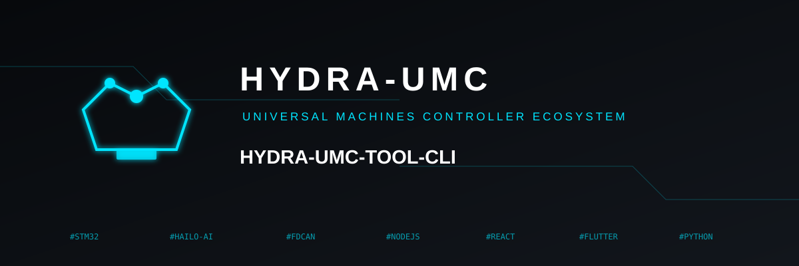

<p align="center">
  
</p>

# 💻 HYDRA-UMC-TOOL-CLI

<p align="center"><a href="README.md">🇺🇸 English</a> | <a href="README_spa.md">🇪🇸 Español</a> | <a href="README_fra.md">🇫🇷 Français</a> | 🇮🇹 <b>Italiano</b> | <a href="README_deu.md">🇩🇪 Deutsch</a> | <a href="README_zho.md">🇨🇳 简体中文</a> | <a href="README_jpn.md">🇯🇵 日本語</a></p>

### 🛠️ Interfaccia a Riga di Comando per DevOps e Automazione della Flotta

<p align="left">
  
  
  
</p>

---

## 1. 🛠️ PANORAMICA TECNICA

**HYDRA-UMC-TOOL-CLI** è il coltellino svizzero per sviluppatori e amministratori di sistema dell'ecosistema HYDRA-UMC. È un singolo binario statico Go che fornisce strumenti a riga di comando per interrogare, aggiornare e verificare i deployment di HYDRA-UMC.

L'obiettivo a lungo termine sono deployment massivi di missioni, aggiornamenti firmware in parallelo (CAN-OTA) e diagnostiche di sistema approfondite direttamente da un terminale o da una pipeline CI/CD. Oggi offre la base reale e funzionante su cui si costruirà tutto il resto: la segnalazione della versione e un client HTTP reale verso HYDRA-UMC-SERVER.

### Caratteristiche Principali:
* ✅ **`hydra-cli version`** — stampa nome e versione del CLI stesso. *(implementato)*
* ✅ **`hydra-cli status [--server URL]`** — interroga il `GET /api/hydra-info` di un'istanza attiva di HYDRA-UMC-SERVER e ne stampa l'identità dichiarata. *(implementato)*
* ✅ **`hydra-cli robots [--server URL]`** — interroga il `GET /api/settings` di un'istanza attiva di HYDRA-UMC-SERVER e ne stampa l'elenco reale di controller/robot (nome, stato online, modello, ruolo). *(implementato)*
* ✅ **Un contratto di exit code reale e stabile** — `0` ok, `1` errore generale, `2` errore d'uso, `3` errore di configurazione, `4` errore di rete, `5` errore del server, `6` non implementato. Ogni comando classifica i propri fallimenti tramite questo contratto invece di un semplice `exit 1`, così gli script che avvolgono questa CLI possono ramificarsi in base al *perché* è fallito. *(implementato)*
* ✅ **`hydra-cli config validate --config PATH`** — carica e valida secondo schema un file di configurazione locale (URL del server, timeout delle richieste). *(implementato)*
* ✅ **`hydra-cli config apply --config PATH [--dry-run]`** — `--dry-run` dimostra il vero percorso di validazione end-to-end e stampa esattamente cosa invierebbe; senza di esso, restituisce onestamente "non implementato" poiché non esiste ancora un endpoint di scrittura della flotta live. *(implementato, solo dry-run)*
* ✅ **`hydra-cli help` / `--help`** — utilizzo completo dei comandi. *(implementato)*
* 🚧 **`hydra-cli deploy`** — carica missioni e configurazioni su una flotta di robot simultaneamente. *(pianificato)*
* 🚧 **`hydra-cli flash-all`** — aggiornamenti firmware in parallelo per controller e teste URTC. *(pianificato)*
* 🚧 **`hydra-cli audit`** — suite diagnostica automatizzata per la salute del bus CAN e la validazione dei sensori. *(pianificato)*

---

## 2. 🔄 FLUSSO DEL CLI


---

## 3. 🧱 ARCHITETTURA E DECISIONI DI PROGETTAZIONE

* **Perché `src/` contiene un sotto-percorso `cmd/hydra-cli/`, non un layout piatto.** Segue la convenzione standard Go per le CLI (un entry point `cmd/<nome-binario>/`, con spazio per futuri pacchetti `internal/`/`pkg/` man mano che la CLI cresce oltre un singolo comando) - non un'invenzione di questo ecosistema, la convenzione propria della più ampia comunità Go per le CLI multi-comando.
* **Perché una CLI, e non semplicemente scriptare direttamente l'API REST propria di HYDRA-UMC-SERVER.** Le operazioni su scala flotta (installare/aggiornare su molti CM5, non solo uno) richiedono una vera orchestrazione - retry, parallelismo, una UX coerente - che uno script curl estemporaneo non offre, lo stesso motivo che HYDRA-UMC-UPDATER applica più avanti a livello dell'intero checkout dell'ecosistema.
* **Perché il punto di ingresso oggi stampa solo identità/versione/ruolo.** Fase di andamiaje: dimostrare che `go build ./cmd/hydra-cli` ha successo precede il vero set di comandi di gestione flotta.
* **Come si inserisce nel resto dell'ecosistema.** Fa su scala flotta ciò che URTC-FLASHER e URTC-TESTER fanno ciascuno per una singola scheda - gestisce istanze di HYDRA-UMC-SERVER attraverso una flotta invece del firmware proprio di una singola scheda.
* **Perché `robots` legge `GET /api/settings` invece di un nuovo endpoint.** Quell'endpoint porta già l'elenco completo di controller/robot ed è già una lettura reale, non autenticata (vedi il proprio `src/server.ts` di HYDRA-UMC-SERVER) - `robots` è un vero client di un contratto già pubblicato, non nuovo lavoro lato server. I comandi più grandi, ancora pianificati (`deploy`/`flash-all`/`audit`), necessitano davvero di nuovi endpoint di scrittura che non esistono ancora.
* **Perché `config apply` senza `--dry-run` restituisce "non implementato" invece di non fare nulla silenziosamente.** L'endpoint di scrittura live su HYDRA-UMC-SERVER che verrebbe chiamato in questo caso davvero non esiste ancora (lo stesso gap su cui sono bloccati `deploy`/`flash-all`) - un exit code distinto, `ExitNotImplemented`, dice a chi chiama "questo è un gap reale, non un bug", invece di un no-op ingannevolmente riuscito.
* **Perché gli errori di ogni comando ora passano attraverso un unico tipo `CliError`/`ExitCode` invece di chiamate ad-hoc a `os.Exit`.** Un contratto di exit code stabile e documentato resta tale solo se esiste un unico punto che assegna i codici - `exitCodeFor()` (`exitcode.go`) è quel punto, e le funzioni dei comandi continuano a restituire valori `error` idiomatici e concatenabili invece di chiamare `os.Exit` da sole.

---

## 📂 STRUTTURA DELLE DIRECTORY

Servizio puramente software (CLI) — senza hardware, firmware o sistema operativo propri; tali cartelle sono omesse secondo la politica della struttura del repository.

```text
HYDRA-UMC-TOOL-CLI/
├── src/                       # Modulo Go
│   ├── go.mod                 # Definizione del modulo (github.com/JuanenRac/HYDRA-UMC-TOOL-CLI)
│   └── cmd/hydra-cli/         # Punto di ingresso del binario
│       ├── main.go            # Smistamento dei comandi (version/help/status/robots/config)
│       ├── server.go          # Risoluzione condivisa di --server/HYDRA_CLI_SERVER
│       ├── robots.go          # Vero client GET /api/settings + stampa dell'elenco
│       ├── config.go          # Caricamento reale del file di configurazione, validazione, apply --dry-run
│       ├── exitcode.go        # Contratto reale e stabile ExitCode/CliError
│       ├── *_test.go          # Test reali (round-trip net/http/httptest, fixture di file temporanei)
│       └── version.go         # const Version = "0.0.0"
├── docs/                      # Documentazione e riferimento comandi
├── build/                     # Binari compilati (ignorato da git)
├── images/                    # Media e diagrammi
├── scripts/                   # Script di utilità
├── bump_version.py            # Incremento versione stile contachilometri (eseguito dal build)
├── build.sh / build.bat       # Build reale: incremento + vera suite di test + go build + smoke test
├── run.sh / run.bat           # Esecuzione reale: avvia il binario compilato
└── README.md
```

---

## 4. ⚙️ COMPILAZIONE ED ESECUZIONE

Richiede Go >= 1.21.

```bash
# Linux/macOS
./build.sh
./run.sh version
./run.sh status --server http://localhost:3000
./run.sh robots --server http://localhost:3000
./run.sh config validate --config ./hydra-cli.json
./run.sh config apply --config ./hydra-cli.json --dry-run
echo $?   # 0=ok 2=uso 3=config 4=rete 5=server 6=non-implementato

# Windows
build.bat
run.bat version
run.bat status --server http://localhost:3000
run.bat robots --server http://localhost:3000
run.bat config validate --config .\hydra-cli.json
run.bat config apply --config .\hydra-cli.json --dry-run
```

`build` incrementa la versione (`src/cmd/hydra-cli/version.go`), esegue la vera suite di test (`go vet` + `go test`), compila il modulo Go in `src/` in `build/hydra-cli(.exe)` ed esegue `version` una volta per verificare. `run` riesegue il binario compilato, inoltrando tutti gli argomenti — prova `run status` o `run robots` contro un'istanza `HYDRA-UMC-SERVER` in esecuzione.

---

## 🔗 Progetti Correlati

Questo progetto fa parte di un ecosistema robotico più ampio dello stesso autore (JuanenRac / Electro Hobby 3D), che copre firmware, software di controllo, nodi IA e strumenti di flotta. Utile saperlo, perché una richiesta potrebbe in realtà riguardare uno di questi progetti anziché questo repository.

### Relazione Diretta

- **[HYDRA-UMC-SERVER](https://github.com/JuanenRac/HYDRA-UMC-SERVER)** — il backend che questa CLI gestisce su scala di flotta.
- **[URTC-FLASHER](https://github.com/JuanenRac/URTC-FLASHER)** — fa su scala di flotta ciò che questo strumento fa per una scheda.
- **[URTC-TESTER](https://github.com/JuanenRac/URTC-TESTER)** — fa su scala di flotta ciò che questo strumento fa per una scheda.

### Resto dell'Ecosistema

**Piattaforma HYDRA-UMC** — la cella di micro-fabbrica multi-robot
- **[HYDRA-UMC](https://github.com/JuanenRac/HYDRA-UMC)** — la scheda madre CM5 + STM32H745 che orchestra fino a 8 bracci robotici.
- **[HYDRA-UMC-SERVER](https://github.com/JuanenRac/HYDRA-UMC-SERVER)** — il backend Express/WebSocket con cui parla ogni client di controllo.
- **[HYDRA-UMC-STUDIO](https://github.com/JuanenRac/HYDRA-UMC-STUDIO)** — dashboard di controllo web, visualizzazione 3D multi-robot.
- **[HYDRA-UMC-ANDROID-CONTROL](https://github.com/JuanenRac/HYDRA-UMC-ANDROID-CONTROL)** — app di controllo Android via Wi-Fi/Bluetooth.
- **[HYDRA-UMC-IOS-CONTROL](https://github.com/JuanenRac/HYDRA-UMC-IOS-CONTROL)** — app di controllo iOS/iPadOS costruita in Flutter.
- **[HYDRA-UMC-SUITE](https://github.com/JuanenRac/HYDRA-UMC-SUITE)** — centro di comando sciame desktop (Python/PySide6).
- **[HYDRA-UMC-EDITOR-URDF](https://github.com/JuanenRac/HYDRA-UMC-EDITOR-URDF)** — editor desktop di modelli URDF per il catalogo robot.
- **[HYDRA-UMC-DSI](https://github.com/JuanenRac/HYDRA-UMC-DSI)** — interfaccia touch nativa per lo schermo DSI a bordo.

**Piattaforma URTC** — il controller della testa utensile che ogni braccio HYDRA-UMC porta con sé
- **[URTC](https://github.com/JuanenRac/URTC)** — controller testa utensile su bus CAN, 25 profili utensile.
- **[URTC-FLASHER](https://github.com/JuanenRac/URTC-FLASHER)** — strumento desktop di flashing CAN-OTA + SWD/JTAG.
- **[URTC-TESTER](https://github.com/JuanenRac/URTC-TESTER)** — strumento desktop di diagnostica CAN live.
- **[URTC-WEB-STUDIO](https://github.com/JuanenRac/URTC-WEB-STUDIO)** — alternativa basata su browser via Web Serial API.

**🎥 Vision AI Node (Hailo-8)**
- [HYDRA-UMC-VISION-NODE](https://github.com/JuanenRac/HYDRA-UMC-VISION-NODE)
- [HYDRA-UMC-VISION-STREAMER](https://github.com/JuanenRac/HYDRA-UMC-VISION-STREAMER)
- [HYDRA-UMC-DETECTION-HEF](https://github.com/JuanenRac/HYDRA-UMC-DETECTION-HEF)
- [HYDRA-UMC-SAFETY-ZONES](https://github.com/JuanenRac/HYDRA-UMC-SAFETY-ZONES)
- [HYDRA-UMC-VISUAL-SERVOING-API](https://github.com/JuanenRac/HYDRA-UMC-VISUAL-SERVOING-API)

**🧠 Cognitive AI Node (Hailo-10)**
- [HYDRA-UMC-COGNITIVE-NODE](https://github.com/JuanenRac/HYDRA-UMC-COGNITIVE-NODE)
- [HYDRA-UMC-VLA-ENGINE](https://github.com/JuanenRac/HYDRA-UMC-VLA-ENGINE)
- [HYDRA-UMC-VOICE-UI](https://github.com/JuanenRac/HYDRA-UMC-VOICE-UI)
- [HYDRA-UMC-SEMANTIC-PLANNER](https://github.com/JuanenRac/HYDRA-UMC-SEMANTIC-PLANNER)
- [HYDRA-UMC-DOCS-QA](https://github.com/JuanenRac/HYDRA-UMC-DOCS-QA)

**🐝 Orchestration & Swarm**
- [HYDRA-UMC-ORCHESTRATOR](https://github.com/JuanenRac/HYDRA-UMC-ORCHESTRATOR)
- [HYDRA-UMC-SWARM-SYNC](https://github.com/JuanenRac/HYDRA-UMC-SWARM-SYNC)
- [HYDRA-UMC-PATH-PLANNER-3D](https://github.com/JuanenRac/HYDRA-UMC-PATH-PLANNER-3D)
- [HYDRA-UMC-JOB-DISPATCHER](https://github.com/JuanenRac/HYDRA-UMC-JOB-DISPATCHER)
- [HYDRA-UMC-NODE-HEALING](https://github.com/JuanenRac/HYDRA-UMC-NODE-HEALING)

**🎮 Digital Twin & Simulation**
- [HYDRA-UMC-TWIN](https://github.com/JuanenRac/HYDRA-UMC-TWIN)
- [HYDRA-UMC-PHYSICS-REPLICA](https://github.com/JuanenRac/HYDRA-UMC-PHYSICS-REPLICA)
- [HYDRA-UMC-HIL-BRIDGE](https://github.com/JuanenRac/HYDRA-UMC-HIL-BRIDGE)
- [HYDRA-UMC-SYNTHETIC-DATA-GEN](https://github.com/JuanenRac/HYDRA-UMC-SYNTHETIC-DATA-GEN)

**📊 Data & Analytics**
- [HYDRA-UMC-DATALAKE](https://github.com/JuanenRac/HYDRA-UMC-DATALAKE)
- [HYDRA-UMC-TELEMETRY-COLLECTOR](https://github.com/JuanenRac/HYDRA-UMC-TELEMETRY-COLLECTOR)
- [HYDRA-UMC-ANOMALY-DETECTOR](https://github.com/JuanenRac/HYDRA-UMC-ANOMALY-DETECTOR)
- [HYDRA-UMC-PRODUCTION-REPORTS](https://github.com/JuanenRac/HYDRA-UMC-PRODUCTION-REPORTS)

**🏭 Industrial Gateway**
- [HYDRA-UMC-GATEWAY-INDUSTRIAL](https://github.com/JuanenRac/HYDRA-UMC-GATEWAY-INDUSTRIAL)
- [HYDRA-UMC-OPCUA-SERVER](https://github.com/JuanenRac/HYDRA-UMC-OPCUA-SERVER)
- [HYDRA-UMC-MQTT-BROKER](https://github.com/JuanenRac/HYDRA-UMC-MQTT-BROKER)
- [HYDRA-UMC-MTCONNECT-ADAPTER](https://github.com/JuanenRac/HYDRA-UMC-MTCONNECT-ADAPTER)

**🛠️ Complementary Tools**
- [URTC-SMART-RACK](https://github.com/JuanenRac/URTC-SMART-RACK)
- [URTC-VISION-TOOL](https://github.com/JuanenRac/URTC-VISION-TOOL)
- [HYDRA-UMC-WATCH](https://github.com/JuanenRac/HYDRA-UMC-WATCH)
- [HYDRA-UMC-DASHBOARD-AI](https://github.com/JuanenRac/HYDRA-UMC-DASHBOARD-AI)


## 👤 AUTORE
**JuanenRac** (Electro Hobby 3D)
📧 electrohobby3d@gmail.com

## 📜 LICENZA
GPL-3.0 - Vedi LICENSE per i dettagli.

## 🛠️ BUILD & RUN

Usa il controllo di compilazione senza versionamento prima di una compilazione di rilascio:

| Azione | Windows | Linux / macOS |
|---|---|---|
| Controllo di compilazione (senza modificare versione o CHANGELOG) | `build-test.bat` | `./build-test.sh` |
| Esecuzione / sviluppo (se disponibile) | `run*.bat` o `dev*.bat` | `./run*.sh` o `./dev*.sh` |

`build-test.bat` e `build-test.sh` compilano o convalidano lo stack del progetto senza incrementare `hydra-umc.project.json` né modificare `CHANGELOG.md`. Possono creare solo i normali output del compilatore. Gli script esistenti `build*.bat`, `build*.sh`, `run*` e `dev*` mantengono il comportamento specifico di versione o esecuzione; usali quando tale comportamento è necessario.