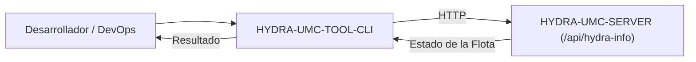

<p align="center">
  
</p>

# 💻 HYDRA-UMC-TOOL-CLI

<p align="center"><a href="README.md">🇺🇸 English</a> | 🇪🇸 <b>Español</b> | <a href="README_fra.md">🇫🇷 Français</a> | <a href="README_ita.md">🇮🇹 Italiano</a> | <a href="README_deu.md">🇩🇪 Deutsch</a> | <a href="README_zho.md">🇨🇳 简体中文</a> | <a href="README_jpn.md">🇯🇵 日本語</a></p>

### 🛠️ Interfaz de Línea de Comandos para DevOps y Automatización de Flotas

<p align="left">
  
  
  
</p>

---

## 1. 🛠️ VISIÓN TÉCNICA GENERAL

**HYDRA-UMC-TOOL-CLI** es la navaja suiza para desarrolladores y administradores de sistemas del ecosistema HYDRA-UMC. Es un único binario estático de Go que ofrece herramientas de línea de comandos para consultar, actualizar y auditar despliegues de HYDRA-UMC.

El objetivo a largo plazo son despliegues masivos de misiones, actualizaciones de firmware en paralelo (CAN-OTA) y diagnósticos profundos del sistema directamente desde una terminal o un pipeline de CI/CD. Hoy incluye la base real y funcional sobre la que se construirá todo lo demás: informe de versión y un cliente HTTP real contra HYDRA-UMC-SERVER.

### Características Clave:
* ✅ **`hydra-cli version`** — imprime el nombre y la versión del propio CLI. *(implementado)*
* ✅ **`hydra-cli status [--server URL]`** — consulta el `GET /api/hydra-info` de una instancia real de HYDRA-UMC-SERVER e imprime su identidad reportada. *(implementado)*
* ✅ **`hydra-cli robots [--server URL]`** — consulta el `GET /api/settings` de una instancia real de HYDRA-UMC-SERVER e imprime su listado real de controladores/robots (nombre, estado en linea, modelo, rol). *(implementado)*
* ✅ **`hydra-cli help` / `--help`** — uso completo de comandos. *(implementado)*
* 🚧 **`hydra-cli deploy`** — sube misiones y configuraciones a una flota de robots simultáneamente. *(planeado)*
* 🚧 **`hydra-cli flash-all`** — actualizaciones de firmware en paralelo para controladores y cabezales URTC. *(planeado)*
* 🚧 **`hydra-cli audit`** — suite de diagnóstico automatizada para la salud del bus CAN y validación de sensores. *(planeado)*

---

## 2. 🔄 FLUJO DEL CLI



---

## 3. 🧱 ARQUITECTURA Y DECISIONES DE DISEÑO

* **Por qué `src/` contiene una subruta `cmd/hydra-cli/`, no un layout plano.** Sigue la convención estándar de CLIs en Go (un punto de entrada `cmd/<nombre-binario>/`, con sitio para futuros paquetes `internal/`/`pkg/` a medida que la CLI crezca más allá de un solo comando) - no es una invención de este ecosistema, es la propia convención de la comunidad Go más amplia para CLIs multi-comando.
* **Por qué una CLI, y no simplemente scriptear directamente la propia API REST de HYDRA-UMC-SERVER.** Las operaciones a escala de flota (instalar/actualizar en muchas CM5, no solo una) necesitan orquestación real - reintentos, paralelismo, una UX consistente - que un script curl improvisado no ofrece, el mismo motivo que HYDRA-UMC-UPDATER aplica después a nivel de todo el checkout del ecosistema.
* **Por qué el punto de entrada solo imprime identidad/versión/rol hoy.** Etapa de andamiaje: probar que `go build ./cmd/hydra-cli` tiene éxito precede al conjunto real de comandos de gestión de flota.
* **Cómo encaja en el resto del ecosistema.** Hace a escala de flota lo que URTC-FLASHER y URTC-TESTER hacen cada uno para una sola placa - gestiona instancias de HYDRA-UMC-SERVER a través de una flota en vez del propio firmware de una sola placa.
* **Por qué `robots` lee `GET /api/settings` en vez de un endpoint nuevo.** Ese endpoint ya lleva el listado completo de controladores/robots y ya es una lectura real, sin autenticación (ver el propio `src/server.ts` de HYDRA-UMC-SERVER) - `robots` es un cliente real de un contrato que ya se publica, no trabajo nuevo del lado del servidor. Los comandos mas grandes, todavia planeados (`deploy`/`flash-all`/`audit`), si necesitan de verdad endpoints de escritura nuevos que aun no existen.

---

## 📂 ESTRUCTURA DE DIRECTORIOS

Servicio puramente software (CLI) — sin hardware/firmware/os propios, podados de la plantilla (ver `SONNET/5.PLAN_EJECUCION_32_PROYECTOS_NUEVOS.txt` para la regla de poda de todo el ecosistema).

```text
HYDRA-UMC-TOOL-CLI/
├── src/                       # Módulo Go
│   ├── go.mod                 # Definición del módulo (github.com/JuanenRac/HYDRA-UMC-TOOL-CLI)
│   └── cmd/hydra-cli/         # Punto de entrada del binario
│       ├── main.go            # Despacho de comandos (version/help/status/robots)
│       ├── server.go          # Resolución compartida de --server/HYDRA_CLI_SERVER
│       ├── robots.go          # Cliente real de GET /api/settings + impresion del listado
│       ├── *_test.go          # Tests reales (round-trips net/http/httptest)
│       └── version.go         # const Version = "0.0.0"
├── docs/                      # Documentación y referencia de comandos
├── build/                     # Binarios compilados (ignorado por git)
├── images/                    # Medios y diagramas
├── scripts/                   # Scripts de utilidad
├── bump_version.py            # Incremento de versión estilo cuentakilómetros (ejecutado por build)
├── build.sh / build.bat       # Build real: incremento + suite de tests real + go build + prueba de humo
├── run.sh / run.bat           # Ejecución real: lanza el binario compilado
└── README.md
```

---

## 4. ⚙️ COMPILACIÓN Y EJECUCIÓN

Requiere Go >= 1.21.

```bash
# Linux/macOS
./build.sh
./run.sh version
./run.sh status --server http://localhost:3000
./run.sh robots --server http://localhost:3000

# Windows
build.bat
run.bat version
run.bat status --server http://localhost:3000
run.bat robots --server http://localhost:3000
```

`build` incrementa la versión (`src/cmd/hydra-cli/version.go`), corre la suite de tests real (`go vet` + `go test`), compila el módulo Go en `src/` a `build/hydra-cli(.exe)`, y ejecuta `version` una vez para verificar. `run` vuelve a ejecutar el binario compilado, reenviando todos los argumentos — prueba `run status` o `run robots` contra una instancia de `HYDRA-UMC-SERVER` en marcha.

---

## 🔗 Proyectos Relacionados

Este proyecto forma parte de un ecosistema de robótica más amplio del mismo autor (JuanenRac / Electro Hobby 3D), que abarca firmware, software de control, nodos de IA y herramientas de flota. Vale la pena conocerlo, ya que una petición podría en realidad ser sobre uno de estos proyectos en vez de sobre este repositorio.

### Relación Directa

- **[HYDRA-UMC-SERVER](https://github.com/JuanenRac/HYDRA-UMC-SERVER)** — el backend que gestiona esta CLI a escala de flota.
- **[URTC-FLASHER](https://github.com/JuanenRac/URTC-FLASHER)** — hace a escala de flota lo que esta herramienta hace para una placa.
- **[URTC-TESTER](https://github.com/JuanenRac/URTC-TESTER)** — hace a escala de flota lo que esta herramienta hace para una placa.

### Resto del Ecosistema

**Plataforma HYDRA-UMC** — la célula de micro-fábrica multi-robot
- **[HYDRA-UMC](https://github.com/JuanenRac/HYDRA-UMC)** — la placa base CM5 + STM32H745 que orquesta hasta 8 brazos robóticos.
- **[HYDRA-UMC-SERVER](https://github.com/JuanenRac/HYDRA-UMC-SERVER)** — el backend Express/WebSocket con el que habla cada cliente de control.
- **[HYDRA-UMC-STUDIO](https://github.com/JuanenRac/HYDRA-UMC-STUDIO)** — panel de control web, visualización 3D multi-robot.
- **[HYDRA-UMC-ANDROID-CONTROL](https://github.com/JuanenRac/HYDRA-UMC-ANDROID-CONTROL)** — app de control Android por Wi-Fi/Bluetooth.
- **[HYDRA-UMC-IOS-CONTROL](https://github.com/JuanenRac/HYDRA-UMC-IOS-CONTROL)** — app de control iOS/iPadOS construida en Flutter.
- **[HYDRA-UMC-SUITE](https://github.com/JuanenRac/HYDRA-UMC-SUITE)** — centro de mando de enjambre de escritorio (Python/PySide6).
- **[HYDRA-UMC-EDITOR-URDF](https://github.com/JuanenRac/HYDRA-UMC-EDITOR-URDF)** — editor de modelos URDF de escritorio para el catálogo de robots.
- **[HYDRA-UMC-DSI](https://github.com/JuanenRac/HYDRA-UMC-DSI)** — interfaz táctil nativa para la pantalla DSI integrada.

**Plataforma URTC** — el controlador de cabezal de herramienta que lleva cada brazo HYDRA-UMC
- **[URTC](https://github.com/JuanenRac/URTC)** — controlador de cabezal de herramienta CAN, 25 perfiles de herramienta.
- **[URTC-FLASHER](https://github.com/JuanenRac/URTC-FLASHER)** — herramienta de escritorio de flasheo CAN-OTA + SWD/JTAG.
- **[URTC-TESTER](https://github.com/JuanenRac/URTC-TESTER)** — herramienta de escritorio de diagnóstico CAN en vivo.
- **[URTC-WEB-STUDIO](https://github.com/JuanenRac/URTC-WEB-STUDIO)** — alternativa basada en navegador vía Web Serial API.

**🎥 Vision AI Node (Hailo-8)**
- [HYDRA-UMC-VISION-NODE](https://github.com/JuanenRac/HYDRA-UMC-VISION-NODE)
- [HYDRA-UMC-VISION-STREAMER](https://github.com/JuanenRac/HYDRA-UMC-VISION-STREAMER)
- [HYDRA-UMC-DETECTION-HEF](https://github.com/JuanenRac/HYDRA-UMC-DETECTION-HEF)
- [HYDRA-UMC-SAFETY-ZONES](https://github.com/JuanenRac/HYDRA-UMC-SAFETY-ZONES)
- [HYDRA-UMC-VISUAL-SERVOING-API](https://github.com/JuanenRac/HYDRA-UMC-VISUAL-SERVOING-API)

**🧠 Cognitive AI Node (Hailo-10)**
- [HYDRA-UMC-COGNITIVE-NODE](https://github.com/JuanenRac/HYDRA-UMC-COGNITIVE-NODE)
- [HYDRA-UMC-VLA-ENGINE](https://github.com/JuanenRac/HYDRA-UMC-VLA-ENGINE)
- [HYDRA-UMC-VOICE-UI](https://github.com/JuanenRac/HYDRA-UMC-VOICE-UI)
- [HYDRA-UMC-SEMANTIC-PLANNER](https://github.com/JuanenRac/HYDRA-UMC-SEMANTIC-PLANNER)
- [HYDRA-UMC-DOCS-QA](https://github.com/JuanenRac/HYDRA-UMC-DOCS-QA)

**🐝 Orchestration & Swarm**
- [HYDRA-UMC-ORCHESTRATOR](https://github.com/JuanenRac/HYDRA-UMC-ORCHESTRATOR)
- [HYDRA-UMC-SWARM-SYNC](https://github.com/JuanenRac/HYDRA-UMC-SWARM-SYNC)
- [HYDRA-UMC-PATH-PLANNER-3D](https://github.com/JuanenRac/HYDRA-UMC-PATH-PLANNER-3D)
- [HYDRA-UMC-JOB-DISPATCHER](https://github.com/JuanenRac/HYDRA-UMC-JOB-DISPATCHER)
- [HYDRA-UMC-NODE-HEALING](https://github.com/JuanenRac/HYDRA-UMC-NODE-HEALING)

**🎮 Digital Twin & Simulation**
- [HYDRA-UMC-TWIN](https://github.com/JuanenRac/HYDRA-UMC-TWIN)
- [HYDRA-UMC-PHYSICS-REPLICA](https://github.com/JuanenRac/HYDRA-UMC-PHYSICS-REPLICA)
- [HYDRA-UMC-HIL-BRIDGE](https://github.com/JuanenRac/HYDRA-UMC-HIL-BRIDGE)
- [HYDRA-UMC-SYNTHETIC-DATA-GEN](https://github.com/JuanenRac/HYDRA-UMC-SYNTHETIC-DATA-GEN)

**📊 Data & Analytics**
- [HYDRA-UMC-DATALAKE](https://github.com/JuanenRac/HYDRA-UMC-DATALAKE)
- [HYDRA-UMC-TELEMETRY-COLLECTOR](https://github.com/JuanenRac/HYDRA-UMC-TELEMETRY-COLLECTOR)
- [HYDRA-UMC-ANOMALY-DETECTOR](https://github.com/JuanenRac/HYDRA-UMC-ANOMALY-DETECTOR)
- [HYDRA-UMC-PRODUCTION-REPORTS](https://github.com/JuanenRac/HYDRA-UMC-PRODUCTION-REPORTS)

**🏭 Industrial Gateway**
- [HYDRA-UMC-GATEWAY-INDUSTRIAL](https://github.com/JuanenRac/HYDRA-UMC-GATEWAY-INDUSTRIAL)
- [HYDRA-UMC-OPCUA-SERVER](https://github.com/JuanenRac/HYDRA-UMC-OPCUA-SERVER)
- [HYDRA-UMC-MQTT-BROKER](https://github.com/JuanenRac/HYDRA-UMC-MQTT-BROKER)
- [HYDRA-UMC-MTCONNECT-ADAPTER](https://github.com/JuanenRac/HYDRA-UMC-MTCONNECT-ADAPTER)

**🛠️ Complementary Tools**
- [URTC-SMART-RACK](https://github.com/JuanenRac/URTC-SMART-RACK)
- [URTC-VISION-TOOL](https://github.com/JuanenRac/URTC-VISION-TOOL)
- [HYDRA-UMC-WATCH](https://github.com/JuanenRac/HYDRA-UMC-WATCH)
- [HYDRA-UMC-DASHBOARD-AI](https://github.com/JuanenRac/HYDRA-UMC-DASHBOARD-AI)


## 👤 AUTOR
**JuanenRac** (Electro Hobby 3D)
📧 electrohobby3d@gmail.com

## 📜 LICENCIA
GPL-3.0 - Ver LICENSE para más detalles.
